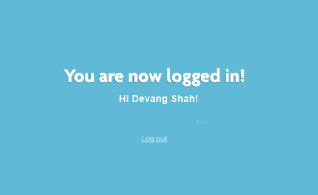

# IS 601 - Project 4

## Project Description
This project's goal to build a Flask Application by following [this tutorial](https://hackersandslackers.com/your-first-flask-application).
Project is part of Final Assessment IS601 that encapsulates Python, Flask, SQLAlchemy, Redis Session Management, Docker and Shell scripting. 

#Snapshots

###Part1
* 
* 
* 
* 
###Part2
* 
###Part3
* 
* 
* 
###Part4
* 
###Part5
* 
###Part6
* 
###Part7
* 
###Part8
* 
###Part9
* 
###Part10
* 
###Part11
* 

##Links to all the parts of the tutorial
####Creating Your First Flask Application
[Part1]("https://hackersandslackers.com/your-first-flask-application")
####Rendering Pages in Flask Using Jinja
[Part2]("https://hackersandslackers.com/flask-jinja-templates")
####Handling Forms in Flask with Flask-WTF
[Part3]("https://hackersandslackers.com/flask-wtforms-forms")
####The Art of Routing in Flask
[Part4]("https://hackersandslackers.com/flask-routes")
####Configuring Your Flask App
[Part5]("https://hackersandslackers.com/configure-flask-applications")
####Demystifying Flask’s Application Factory
[Part6]("https://hackersandslackers.com/flask-application-factory")
####Organizing Flask Apps with Blueprints
[Part7](https://hackersandslackers.com/flask-blueprints)
####Compiling Frontend JavaScript & Stylesheets Flask
[Part8]("https://hackersandslackers.com/flask-assets")
####Connect Flask to a Database with Flask-SQLAlchemy
[Part9](https://hackersandslackers.com/flask-sqlalchemy-database-models)
####Handle User Accounts & Authentication in Flask with Flask-Login
[Part10]("https://hackersandslackers.com/flask-login-user-authentication")
####Managing Session Data with Flask-Session & Redis
[Part11]("https://hackersandslackers.com/managing-user-session-variables-with-flask-sessions-and-redis")

